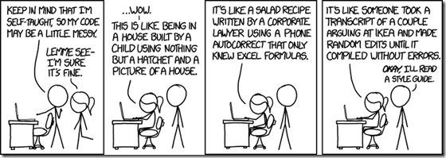

## The Standard.
When I started making my very first lines of code, I often typed without any real organization or convention to it. I figured there are many ways to get to Rome- and my code gets to Rome, so what could be wrong. However, I learned very quickly why this was a bad practice. I would often find myself just getting lost in my code and when I would ask for help from peers, they would get lost, too. This is because the readability of your code drastically declines when you don't have a set of conventional guidelines. It is like wr i t in g wit hou T prop er spAc i n g a nd Capi t aL iz a tion . You probably read the previous sentence slower, maybe with a stutter, and perhaps had to read it twice. Although you can properly string together the proper sequence of characters to spell out words, a sentence is not easily readable without our grammatical conventions. Similarly, although the code youve typed out may execute successfully, it is not readable without a set of coding conventions. This is why we have a coding standard. A coding standard is a set guideline of conventions for your code, to improve oraganization, cleanliness, and readibility. It is essential to use coding standards to create sophisticated, readable code.

## The Fashion Dos of Javascript
<!--  -->

When you use a coding standard, you are dressing your code with style. Her look is fresh and very easy on the eyes. In the past week we were given a coding standard for Javascript for us as a class to follow uniformly. This was enforced by <a href="https://eslint.org/">ESLint</a>. Using automation to check our code for proper conventions allows us to focus on the actual code itself. Automated utilities such as ESLint act as the fashion police for our code, stopping us from being held back by wardrobe malfunctions and walking out in haphazard dress.

## Stress free coding
We used ESLint while coding Javascript programs through the <a href="https://www.jetbrains.com/idea/">Intellij</a> IDE. Prior to doing so, we were programming in Javascript through <a href="https://jsfiddle.net/">jsfiddle</a> where no external utility checked our code. With this change, I noticed how much easier it was to catch my error or event prevent them from moving on with them in the first place. ESLint came with a little green checkmark in the top right corner which, at first was a bit stressful to me trying to fix all the tiny conventions at the end of my coding; however, I found it got much easier as I learned to look at it more frequently as i am coding.

## Final thoughts
I am glad that there is a standard for coding. Without it, we everyone would not be on the same page and programming would be much less efficient. I think it also has made learning to code somewhat easier in a way. Albeit some might argue that it is another thing to memorize, once you get the hang of it, you are able to focus more on learning the code and not getting caught in errors and readability problems in all your code. After this week, I can feel more confident that my code is executing with a sophisticated and fresh style.
