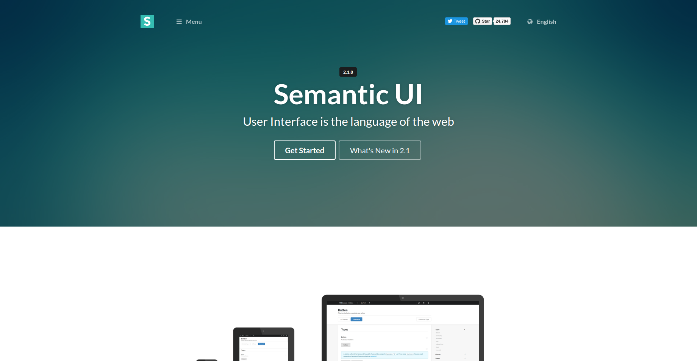

    

## Coding Raw

Prior to last week, we have been programming in HTML and CSS raw. My first impressions looking at a raw HTML file is how unintuitive it feels. It barely felt like english, even for a programming language. However, this week, we were introduce to a refreshing user interface framework, "Semantic UI".

## The English Semantics of Semantic UI

Semantic UI was a breath of fresh air because it uses the our English language to set up attractive UI elements. This is much more convenient and intuitive than coding in raw HTML. I also like how the design of its features are clean and actually appealing even in default. The default HTML elements are absolutely hideous from a design standpoint. It looks flat, outdated, and cluttered. Take this button for example. I think its actually very important that the visual design of a web page is clean and appealing because it attracts your audience to actually read what you have to say. Also, there is a rhetorical value in visuals and it plays a huge part in human communication. It is no wonder the Semantic UI Webpage claims UI is "The Language of the Web"

## The Antics of Learning Semantics

As much as I was attracted to the concept of Semantic UI (as glorified in the previous paragraph), there was definitely a catch. It took quite a bit of getting used to and it honestly felt like learning a whole new programming language on its own. The practice WOD assignments this past week did take some time. I also found myself having to back to improve my runtime to Rx. I did end up getting used to it by learning what tools I needed as I used them and effectively referencing the <a href="https://semantic-ui.com/">Semantic UI website</a>. Like learning a programming language, there is definitely a bit of a learning curve to it, however, I think its worth it in the long run. 

## Conclusion

I will definitely be using Semantic UI and/or other UI frameworks in the future. It is a smart way to efficiently and intuitively build attractive UI.
