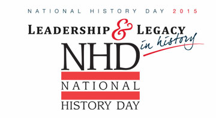
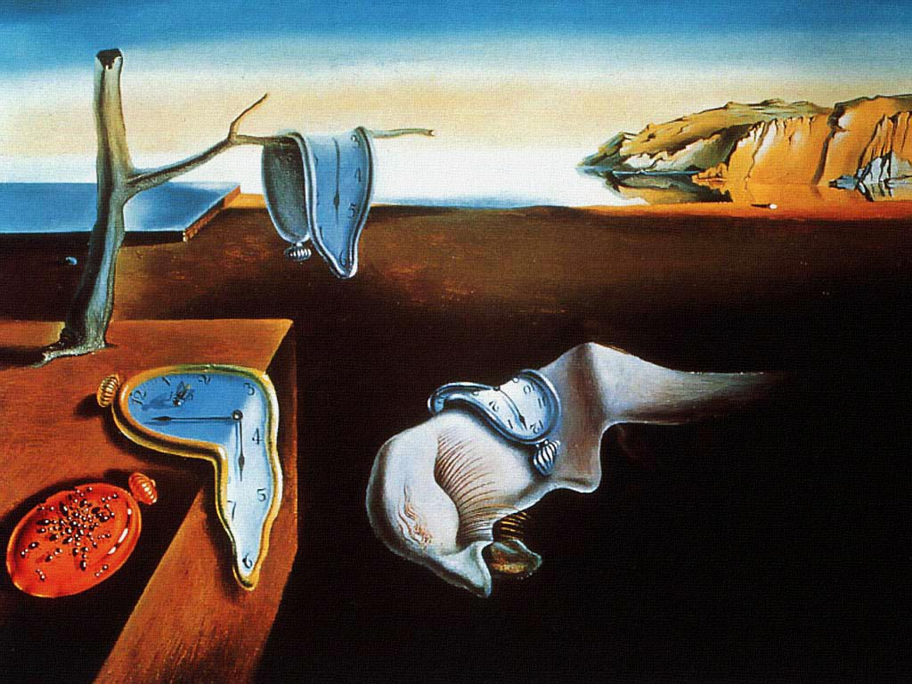
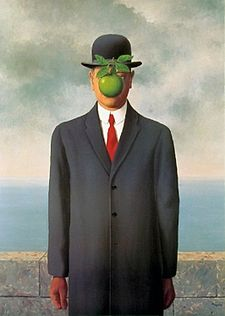

  

National History Day is a nationally recognized competition in which over half a million middle and highschool students around the globe are share their knowledge of historical topics in the form of a paper, exhibit, performance, website, or documentary. Students are able to freely choose their topic in compliance with a theme. Each entry presented to and judged by a panel of scholars, followed by an interview. Those who place at the top in a series of regional events get to proceed to the National Contest in Washington D.C..

  
  

I have made it to the National Competition in the group documentary category twice throughout highschool. The first time was in 2015 for the theme "Leadership and Legacy." My partner and I submitted a documentary entitled "Andre Breton: The Leadership in the Surrealist Movement and His Legacy in the Art World". The documentary analyzes the involment of french poet and author, Andre Breton in the psychologically rooted art movement of the 1920's, surrealism, and examines the profound cultural, technological, and political legacy.

The documentary started out as a paper I had written by myself over as an A.P. World History summer break assignment. I decided to write about the surrealist art movement because of the interest I had in art and psychology. It was largely my interest and enthusiasm about the topic that helped me to write a strong paper.

After writing, I found a partner who helped me revise and edit the paper into a script for a documentary. I was just dipping my feet into video editting and using "Final Cut Pro" at the time, and I knew that a documentary would be the best way to share such a visually involved topic. We also conducted interviews with scholars knowledgable in art history where I learned a lot about professional communication and interview processes. After weeks of filming, recording, and editting, we were finally able to share to various regional competitions and eventually the panel of judges seated at the national competition.

I learned a lot from both my experiences with National History Day. The competition improved my writing, collaboration skills, public speaking, and professionalism. I was also able to feel what is like to really be put under pressure and effectively problem solve through unexpected obstacles. I'll always value what the National History Day process has taught me and will apply it to hopefully accomplish even bigger projects. 

For more information on National History Day visit: [https://www.nhd.org/](https://www.nhd.org/)

