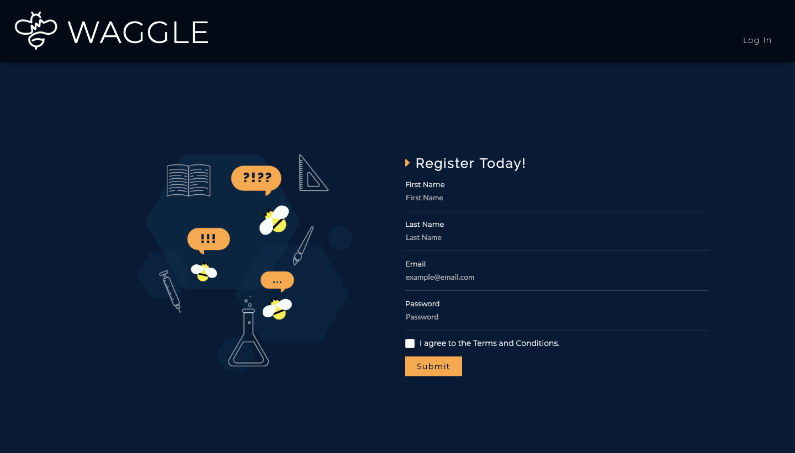
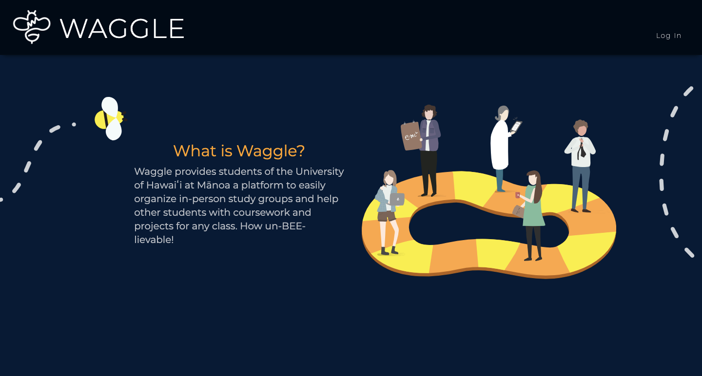
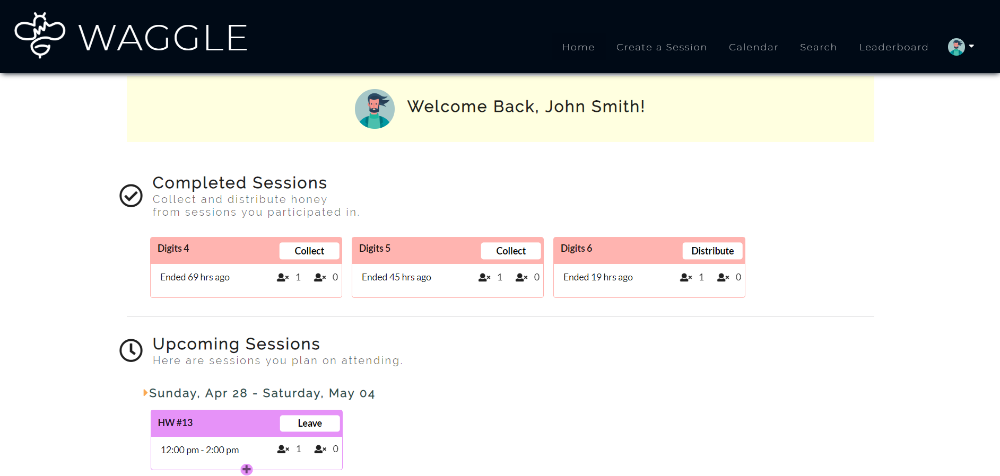
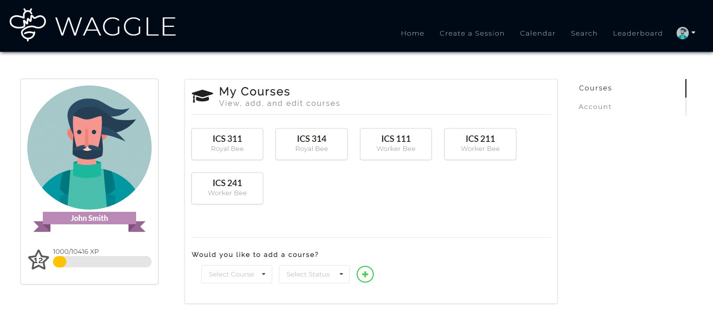
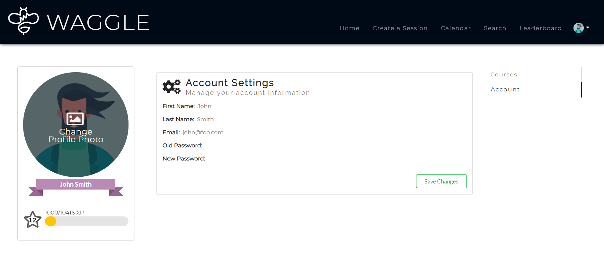

  
  

## Waggle What!?
The term "Waggle" refers to dance that honey bees perform to help find food. My group, ["The Hive Manoa"](https://thehivemanoa.github.io/), came up with a web application called ["Waggle"](https://thehivemanoa.github.io/waggle/). In this web application, UH Manoa students act as bees working to collect as much honey as they can. They earn this honey by joining and creating course related study sessions. Those who collect the most honey can see their names at the top of the leaderboard!

## How I Role
For this project I was mainly in charge of putting together the landing registration, user homepage, and the user profile page. This meant closely working with Meteor's Accounts API and our created Profiles API. 

The user homepage lets users see upcoming and completed joined sessions. 

  

The user profile page allows users to add/edit their courses and edit their profile/account information. The user profile page also displays all the users information in a profile card.

  
  

## What I Learned

Through this project, I felt like I was able to really hone my software development skills and adopt new ones as I was constantly trying to program things outside of my comfort zone. I was also able to better my teamwork and communication skills. As a group we made time to regularly meet up and update eachother on our tasks and progress. We found ourselves with huge schedule conflicts but managed to make time both in person and through voice calls. I also got to learn a lot about how the features on GitHub can help make sure the collaborative process is well communicated and up to date. Overall, I think my group communicated and worked really well together, enabling us to make a really cool first big web application.

Visit [The Waggle Information Page](https://thehivemanoa.github.io/waggle/)!
Visit [The Hive Manoa Information Page](https://thehivemanoa.github.io/)!
Visit [Our Github Repositories](https://github.com/thehivemanoa)!
